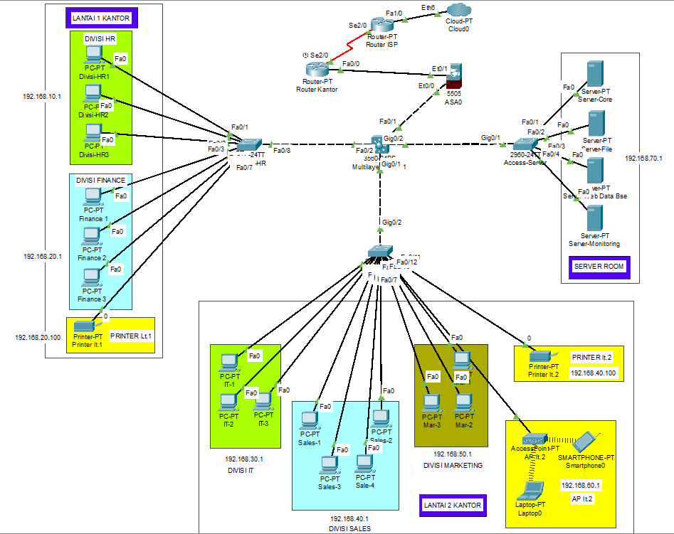

# Enterprise Network Infrastructure & Security

A simulated enterprise network infrastructure and security environment implemented using Cisco Packet Tracer.

The project demonstrates VLAN segmentation, inter-VLAN routing, centralized DHCP, NAT/PAT, extended ACL-based access control, wireless network isolation, least-privilege server access, and centralized Syslog monitoring.

---

## Project Overview

This project simulates a small enterprise network consisting of multiple departments, wireless users, dedicated servers, and centralized network monitoring.

The network uses VLAN-based segmentation to separate departments and services. A multilayer switch provides inter-VLAN routing, while extended ACLs enforce security policies between network segments.

### Objectives

- Implement VLAN-based network segmentation
- Configure inter-VLAN routing using a multilayer switch
- Implement centralized DHCP services
- Provide Internet connectivity using NAT/PAT
- Apply extended ACLs for traffic control
- Implement least-privilege server access
- Isolate wireless users from internal network segments
- Centralize network event logging using Syslog
- Verify network functionality and security policies through testing

---

## Network Architecture

The simulated enterprise environment consists of:

- Multilayer Core Switch
- Access switches
- Edge router
- Departmental user networks
- Wireless user network
- Dedicated server network
- Centralized monitoring server
- Simulated Internet connection

### Network Topology



---

## VLAN & IP Addressing

| VLAN | Network | Gateway | Purpose |
|------|---------|---------|---------|
| VLAN 10 | 192.168.10.0/24 | 192.168.10.1 | HR |
| VLAN 20 | 192.168.20.0/24 | 192.168.20.1 | Finance |
| VLAN 30 | 192.168.30.0/24 | 192.168.30.1 | IT |
| VLAN 40 | 192.168.40.0/24 | 192.168.40.1 | Sales |
| VLAN 50 | 192.168.50.0/24 | 192.168.50.1 | Marketing |
| VLAN 60 | 192.168.60.0/24 | 192.168.60.1 | WiFi |
| VLAN 70 | 192.168.70.0/24 | 192.168.70.1 | Servers |
| VLAN 99 | 192.168.99.0/24 | 192.168.99.1 | Management |

---

## Core Network Functions

### VLAN Segmentation

Departmental users are separated into dedicated VLANs to provide logical network segmentation and reduce unnecessary Layer 2 communication.

Each department operates within its own IPv4 subnet.

### Inter-VLAN Routing

The multilayer switch provides Layer 3 connectivity between VLANs using Switched Virtual Interfaces (SVIs).

The configured VLAN interfaces include:

```text
Vlan10   192.168.10.1
Vlan20   192.168.20.1
Vlan30   192.168.30.1
Vlan40   192.168.40.1
Vlan50   192.168.50.1
Vlan60   192.168.60.1
Vlan70   192.168.70.1
Vlan99   192.168.99.1
```

### Centralized DHCP

DHCP services are provided by the Server-Core host:

```text
192.168.70.10
```

DHCP relay is configured on the multilayer switch for VLANs that require centralized address assignment.

Example:

```text
ip helper-address 192.168.70.10
```

This allows clients in different VLANs to obtain their IP configuration from the centralized DHCP server.

### NAT/PAT

The edge router provides Internet connectivity using dynamic NAT/PAT.

Private enterprise addresses are translated through the router's external interface before accessing the simulated Internet.

NAT operation was verified using:

```text
show ip nat translations
show ip nat statistics
```

The verification evidence demonstrates active dynamic translations generated by client Internet traffic.

---

## Security Controls

### Management Network Protection

The management network uses VLAN 99:

```text
192.168.99.0/24
```

An extended ACL is used to restrict unauthorized access to the management network.

The implemented policy includes:

```text
deny ip any 192.168.99.0 0.0.0.255
permit ip any any
```

This prevents general traffic from reaching the management subnet.

### Wireless Network Isolation

Wireless users are assigned to VLAN 60:

```text
192.168.60.0/24
```

An extended ACL restricts wireless users from accessing internal departmental networks and server networks while allowing permitted external connectivity.

The policy blocks access from VLAN 60 to:

- VLAN 10 — HR
- VLAN 20 — Finance
- VLAN 30 — IT
- VLAN 40 — Sales
- VLAN 50 — Marketing
- VLAN 70 — Servers
- VLAN 99 — Management

### Server Access Control

The server network is located in VLAN 70:

```text
192.168.70.0/24
```

Server access is controlled using extended ACL policies.

The web server is:

```text
192.168.70.10
```

HTTPS access from selected internal departments is explicitly permitted:

```text
permit tcp <department-network> host 192.168.70.10 eq 443
```

Other IP traffic toward the web server is denied.

This demonstrates a least-privilege access model where required application access is allowed while unnecessary access is restricted.

### ACL-Based Segmentation

Extended ACLs are used to enforce traffic policies between network segments.

Examples of implemented controls include:

```text
WiFi → Internal VLANs       DENY
WiFi → Server Network       DENY
Users → Management VLAN     DENY
Users → Web Server HTTPS    ALLOW
Users → Other Server Traffic DENY
```

---

## Centralized Monitoring

Network events are forwarded to a centralized monitoring server using Syslog.

Monitoring server:

```text
192.168.70.40
```

The core switch is configured with:

```text
logging 192.168.70.40
```

Syslog operation was verified on the monitoring server, where configuration and system events from the core switch were received.

This provides centralized visibility into network events and device activity.

---

## Verification & Testing

The implementation was validated using connectivity, configuration, and security tests.

### Verified Functions

- VLAN segmentation
- Inter-VLAN routing
- DHCP address assignment
- Internet connectivity
- NAT/PAT translation
- Wireless network isolation
- Server access control
- HTTPS access policy
- Centralized Syslog logging

The verification results and screenshots are available in the [`evidence`](./evidence/) directory.

---

## Evidence

| Evidence | Description |
|----------|-------------|
| [VLAN & Inter-VLAN Routing](./evidence/01-vlan-and-inter-vlan-routing.png) | VLAN/SVI configuration and Layer 3 routing verification |
| [VLAN & Inter-VLAN Routing — Part 1](./evidence/03-vlan-and-inter-vlan-routing-1.png) | Additional VLAN and inter-VLAN routing verification |
| [VLAN & Inter-VLAN Routing — Part 2](./evidence/03-vlan-and-inter-vlan-routing-2.png) | Additional VLAN and inter-VLAN routing verification |
| [DHCP Verification](./evidence/02-dhcp-verification.png) | Centralized DHCP configuration and verification |
| [NAT/PAT & Internet](./evidence/03-nat-pat-internet.png) | Dynamic NAT/PAT translations and Internet connectivity |
| [WiFi VLAN Isolation](./evidence/04-wifi-vlan-isolation.png) | Verification of wireless network access restrictions |
| [Server Access Denied](./evidence/05-server-access-denied.png) | Verification of restricted server access |
| [HTTPS Access Allowed](./evidence/05-server-https-allowed.png) | Verification of permitted HTTPS access |
| [Centralized Syslog](./evidence/06-syslog-centralized-monitoring.png) | Syslog messages received by the centralized monitoring server |

---

## Project Structure

```text
enterprise-network-security/
│
├── configuration/
│   └── README.md
│
├── evidence/
│   ├── 01-vlan-and-inter-vlan-routing.png
│   ├── 02-dhcp-verification.png
│   ├── 03-nat-pat-internet.png
│   ├── 03-vlan-and-inter-vlan-routing-1.png
│   ├── 03-vlan-and-inter-vlan-routing-2.png
│   ├── 04-wifi-vlan-isolation.png
│   ├── 05-server-access-denied.png
│   ├── 05-server-https-allowed.png
│   ├── 06-syslog-centralized-monitoring.png
│   └── README.md
│
├── packet-tracer/
│   └── enterprise-network-security.pkt
│
├── topology/
│   ├── README.md
│   └── enterprise-network-topology.png
│
└── README.md
```

---

## Technologies

- Cisco Packet Tracer
- Cisco IOS
- VLAN
- Inter-VLAN Routing
- Switched Virtual Interface (SVI)
- DHCP
- DHCP Relay
- NAT/PAT
- Extended ACL
- Syslog
- TCP/IP
- IPv4 Networking

---

## Future Improvements

Potential improvements for future iterations include:

- Implementing OSPF dynamic routing
- Adding redundant core and distribution paths
- Optimizing Spanning Tree Protocol configuration
- Implementing AAA authentication
- Implementing SSH-based device management
- Expanding network monitoring and logging
- Adding additional security policies
- Introducing firewall-based segmentation
- Implementing high-availability network design

---

## Project Status

**Completed — Initial Enterprise Network Infrastructure & Security Implementation**

The current implementation provides a functional enterprise networking and security laboratory that can be further extended with dynamic routing, redundancy, advanced authentication, and firewall-based security controls.
